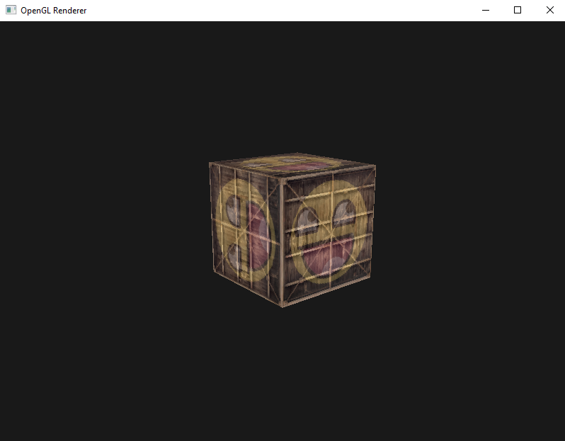

<!-- PROJECT LOGO -->
 

  

  <h3 align="center">OpenGL Renderer</h3>

  

    A simple OpenGL Renderer / Model Viewer

<!-- ABOUT THE PROJECT -->
## About The Project

When finished, this renderer will be able to render loaded models while exposing various options to tweak the render.

Libraries used:
* OpenGL for rendering
* IMGUI for UI
* ASSIMP for model loading
